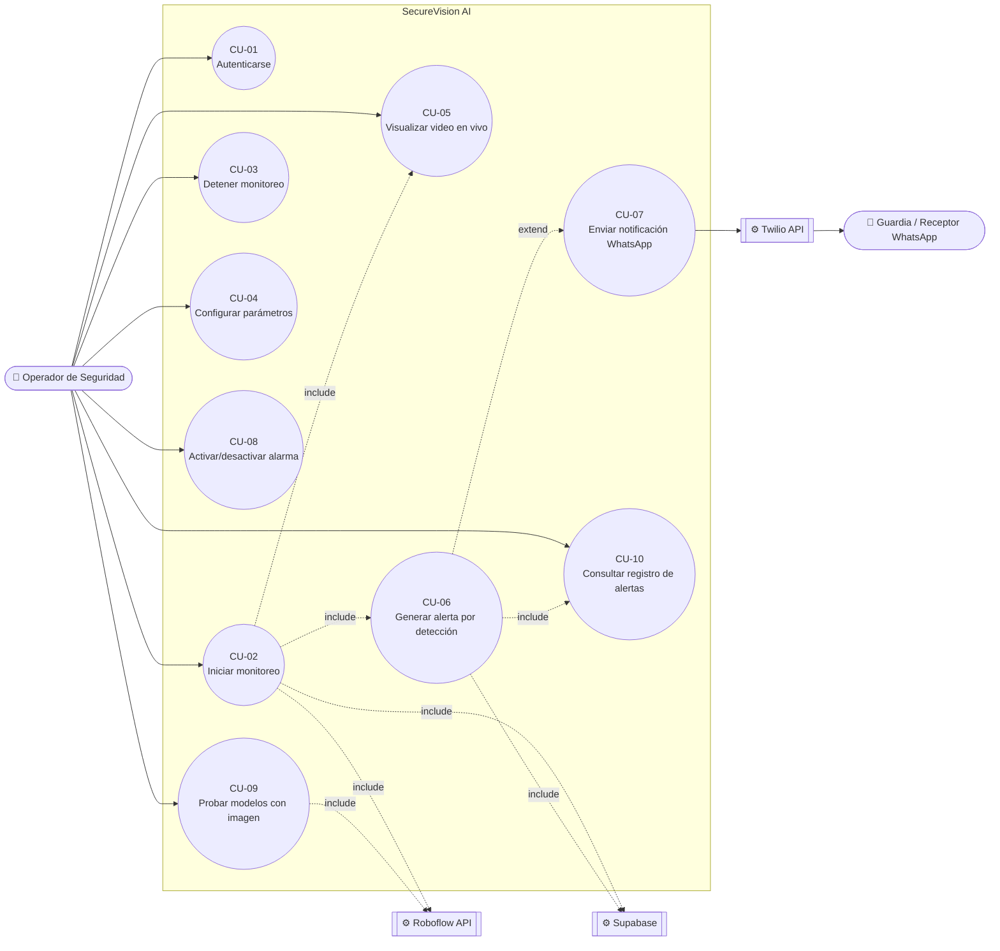
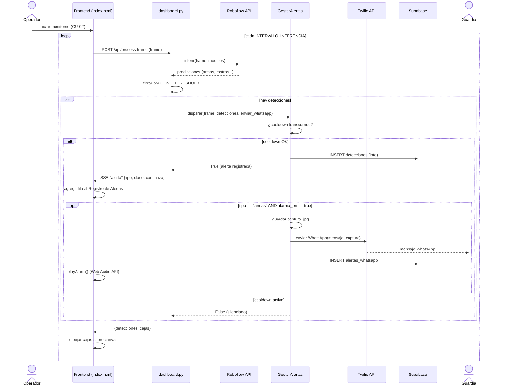

# SecureVision AI — Documentación Técnica
## SI904 Seguridad de Sistemas · Universidad Nacional de Ingeniería

---

## 1. Descripción General

**SecureVision AI** es un sistema de vigilancia inteligente para seguridad ciudadana que detecta en tiempo real la presencia de armas, rostros y placas vehiculares mediante modelos de visión artificial alojados en Roboflow. Ante la detección de un arma, el sistema envía una alerta automática por WhatsApp al número de guardia configurado, activa una alarma sonora en el panel web y persiste el evento en una base de datos Supabase (PostgreSQL).

**Propósito:** Proveer a organismos de seguridad pública y privada una herramienta de monitoreo continuo, escalable y con notificación en tiempo real, sin requerir hardware especializado más allá de una webcam convencional.

**Valor diferencial:**
- Inferencia en la nube (Roboflow API) — sin GPU local requerida
- Alertas WhatsApp con validación de entrega (Twilio)
- Panel web accesible desde cualquier navegador en la misma red
- Persistencia histórica en Supabase con esquema relacional

---

## 2. Arquitectura del Sistema

```
┌─────────────────────────────────────────────────────────────────┐
│                        CAPA DE CAPTURA                          │
│   Webcam / Fuente de video  →  src/camara.py (cv2.VideoCapture) │
└────────────────────────────────┬────────────────────────────────┘
                                 │ frame BGR
┌────────────────────────────────▼────────────────────────────────┐
│                      CAPA DE INFERENCIA                         │
│            src/detector.py  →  Roboflow API (HTTPS)             │
│   ┌──────────────┐  ┌───────────────────┐  ┌────────────────┐  │
│   │ weapon-qpfo8 │  │face-detection-yyxs│  │license-plate-w8│  │
│   └──────────────┘  └───────────────────┘  └────────────────┘  │
└────────────────────────────────┬────────────────────────────────┘
                                 │ lista de detecciones
┌────────────────────────────────▼────────────────────────────────┐
│                     CAPA DE DECISIÓN                            │
│   dashboard.py: _loop_camara()                                  │
│   ¿tipo == "armas" AND confianza >= umbral AND cooldown OK?     │
└──────┬─────────────────────────────────────────┬────────────────┘
       │ SÍ: alerta                              │ siempre
┌──────▼──────────────────┐          ┌───────────▼────────────────┐
│  CAPA DE NOTIFICACIÓN   │          │    CAPA DE PRESENTACIÓN     │
│  src/alertas.py         │          │    dashboard.py (Flask)     │
│  Twilio WhatsApp API    │          │    Stream MJPEG  /video_feed│
│  Guardar captura .jpg   │          │    Eventos SSE   /events    │
│  Alarma Web Audio API   │          │    API REST      /api/*     │
└──────┬──────────────────┘          └───────────┬────────────────┘
       │                                         │
┌──────▼─────────────────────────────────────────▼────────────────┐
│                     CAPA DE PERSISTENCIA                        │
│   src/database.py  →  Supabase (PostgreSQL en la nube)          │
│   sesiones / detecciones / alertas_whatsapp                     │
└─────────────────────────────────────────────────────────────────┘
```

---

## 3. Estructura del Proyecto

```
SI904-M2/
├── dashboard.py              # Servidor Flask principal + bucle de cámara
├── main.py                   # Punto de entrada alternativo (CLI)
├── config.py                 # Variables de configuración globales
├── requirements.txt          # Dependencias Python
├── .env                      # Credenciales y configuración (NO versionar)
│
├── src/
│   ├── __init__.py
│   ├── camara.py             # Wrapper de cv2.VideoCapture
│   ├── detector.py           # Motor de detección Roboflow
│   ├── alertas.py            # Gestor de alertas WhatsApp (Twilio)
│   ├── database.py           # Integración Supabase (PostgreSQL)
│   └── utils.py              # Dibujo de detecciones y logger
│
├── templates/
│   ├── index.html            # Dashboard SPA (Landing + Monitor + Testing)
│   └── login.html            # Página de autenticación
│
├── static/
│   └── img/
│       ├── hero.png          # Imagen hero de la landing page
│       └── detection.png     # Imagen demo de detecciones
│
├── docs/
│   ├── DOCUMENTACION.md      # Este archivo
│   ├── REQUERIMIENTOS.md     # Especificación de requerimientos
│   ├── schema_supabase.sql   # Script SQL para crear las tablas en Supabase
│   └── diagramas/            # Diagramas de arquitectura
│
├── tests/
│   └── test_*.py             # Suite de pruebas unitarias (10/10)
│
└── capturas/                 # Imágenes guardadas al disparar alertas
```

---

## 4. Instalación y Configuración

### 4.1 Requisitos del sistema

| Requisito | Versión mínima | Notas |
|---|---|---|
| Python | 3.9 — 3.12 | inference-sdk NO soporta Python 3.13+ |
| Webcam | Cualquier USB/integrada | Índice configurable (default: 0) |
| Conexión a Internet | Permanente | Roboflow API + Twilio + Supabase |
| Memoria RAM | 4 GB | Recomendado 8 GB |
| SO | Windows 10+ / Ubuntu 20.04+ | Probado en Windows 11 |

### 4.2 Instalación de dependencias

```powershell
# Crear entorno virtual
python -m venv venv
.\venv\Scripts\activate   # Windows
# source venv/bin/activate  # Linux/Mac

# Instalar dependencias
pip install -r requirements.txt
```

### 4.3 Variables de entorno (.env)

Crear el archivo `.env` en la raíz del proyecto con las siguientes variables:

| Variable | Descripción | Ejemplo |
|---|---|---|
| `ROBOFLOW_API_KEY` | API Key de Roboflow | `slpWABkeOQ5xdjdXPW8w` |
| `ROBOFLOW_MODEL_ARMAS` | ID del modelo de armas | `weapon-qpfo8/1` |
| `ROBOFLOW_MODEL_ROSTROS` | ID del modelo de rostros | `face-detection-yyxs8/2` |
| `ROBOFLOW_MODEL_PLACAS` | ID del modelo de placas | `license-plate-w8chc/1` |
| `CONF_THRESHOLD` | Umbral de confianza mínimo | `0.40` |
| `COOLDOWN_SEGUNDOS` | Segundos entre alertas del mismo tipo | `30` |
| `INTERVALO_INFERENCIA` | Segundos entre ciclos de inferencia | `1` |
| `TWILIO_ACCOUNT_SID` | SID de cuenta Twilio | `ACxxxxxxxxxxxx` |
| `TWILIO_AUTH_TOKEN` | Token de autenticación Twilio | `05ea00d92d...` |
| `TWILIO_WHATSAPP_FROM` | Número Twilio sandbox | `whatsapp:+14155238886` |
| `TWILIO_WHATSAPP_TO` | Número de guardia receptor | `whatsapp:+51914027388` |
| `SUPABASE_URL` | URL del proyecto Supabase | `https://xxx.supabase.co` |
| `SUPABASE_KEY` | API Key de Supabase (anon o service_role) | `eyJ...` |
| `DASHBOARD_USER` | Usuario del panel web | `admin` |
| `DASHBOARD_PASS` | Contraseña del panel web | `securevision2026` |
| `DASHBOARD_SECRET_KEY` | Clave secreta para cookies Flask | `sv_k3y_si904_uni_2026` |

---

## 5. Módulos del Sistema

### 5.1 `src/detector.py` — Motor de Detección

Clase `DetectorRoboflow` que encapsula la comunicación con la Roboflow Inference API.

**Responsabilidades:**
- Inicializar el cliente `InferenceHTTPClient` con la API Key configurada
- Ejecutar inferencia paralela sobre los modelos seleccionados para cada frame
- Filtrar detecciones por umbral de confianza (`CONF_THRESHOLD`)
- Normalizar el resultado al formato estándar del proyecto: `{tipo, clase, confianza, x1, y1, x2, y2}`

**Método principal:**
```python
def inferir(self, frame: np.ndarray, modelos: list[str]) -> list[dict]:
    """
    Ejecuta inferencia sobre el frame con los modelos indicados.
    Retorna lista de detecciones filtradas por umbral.
    """
```

### 5.2 `src/alertas.py` — Gestor de Alertas WhatsApp

Clase `GestorAlertas` que controla el envío de mensajes Twilio.

**Responsabilidades:**
- Verificar que el cooldown haya transcurrido antes de enviar una alerta
- Guardar una captura del frame en `capturas/` con timestamp
- Enviar mensaje WhatsApp estructurado via Twilio API
- Actualizar el timestamp de la última alerta enviada

**Lógica de cooldown:**
```
tiempo_actual - ultima_alerta_ts >= COOLDOWN_SEGUNDOS  →  enviar
tiempo_actual - ultima_alerta_ts <  COOLDOWN_SEGUNDOS  →  silenciar
```

### 5.3 `src/camara.py` — Captura de Video

Clase `Camara` como context manager sobre `cv2.VideoCapture`.

**Responsabilidades:**
- Abrir y liberar correctamente el recurso de cámara
- Proveer método `leer_frame()` que retorna el frame en BGR o `None` si falla

### 5.4 `src/database.py` — Persistencia en Supabase

Módulo de integración con Supabase (PostgreSQL en la nube).

**Funciones principales:**

| Función | Descripción |
|---|---|
| `iniciar_sesion(modelos, fuente, conf)` | Crea fila en `sesiones`, retorna el ID |
| `cerrar_sesion(id, frames, alertas)` | Actualiza métricas finales de la sesión |
| `registrar_detecciones_lote(id, dets, flag)` | Insert masivo en `detecciones` |
| `registrar_alerta_whatsapp(...)` | Registra alerta enviada en `alertas_whatsapp` |
| `obtener_sesiones(limite)` | Consulta historial de sesiones |

**Tolerancia a fallos:** Si `SUPABASE_URL` o `SUPABASE_KEY` no están configurados, todas las funciones retornan `None`/`False` silenciosamente sin interrumpir el sistema.

### 5.5 `src/utils.py` — Utilidades

**Funciones:**
- `dibujar_detecciones(frame, detecciones)` — Dibuja cajas delimitadoras codificadas por color sobre el frame
- `obtener_logger(nombre)` — Retorna logger configurado con formato timestamp

**Código de colores:**

| Tipo | Color | RGB |
|---|---|---|
| `armas` | Rojo | (0, 0, 220) |
| `rostros` | Verde | (0, 200, 0) |
| `placas` | Naranja | (0, 140, 255) |

### 5.6 `dashboard.py` — Servidor Web Flask

Módulo principal que integra todos los componentes.

**Componentes internos:**
- `_estado` — Diccionario global con métricas de la sesión actual (protegido por `threading.Lock`)
- `_loop_camara()` — Hilo daemon de captura + inferencia + notificación
- `_eventos_q` — Cola SSE para eventos en tiempo real (máx. 200 elementos)
- `_ultimo_frame_jpg` — Buffer del último frame codificado como JPEG

---

## 6. API REST del Dashboard

| Endpoint | Método | Auth | Descripción | Respuesta |
|---|---|---|---|---|
| `/` | GET | ✅ Requerida | Sirve el dashboard HTML (SPA) | HTML |
| `/login` | GET | ❌ Pública | Formulario de inicio de sesión | HTML |
| `/login` | POST | ❌ Pública | Valida credenciales y crea sesión | Redirect |
| `/logout` | GET | ✅ Requerida | Destruye la sesión Flask | Redirect a /login |
| `/video_feed` | GET | ✅ Requerida | Stream MJPEG con anotaciones en vivo | `multipart/x-mixed-replace` |
| `/events` | GET | ✅ Requerida | Server-Sent Events de detecciones y alertas | `text/event-stream` |
| `/api/stats` | GET | ✅ Requerida | Estadísticas de la sesión actual | JSON |
| `/api/alerts` | GET | ✅ Requerida | Historial de las últimas 50 alertas | JSON array |
| `/api/control` | POST | ✅ Requerida | Iniciar / detener el sistema | JSON `{ok, mensaje}` |
| `/api/test-image` | POST | ✅ Requerida | Inferencia sobre imagen subida | JSON `{imagen_b64, detecciones, total}` |

### Formato `/api/stats`
```json
{
  "activo": true,
  "frames": 1240,
  "det_armas": 3,
  "det_rostros": 87,
  "det_placas": 0,
  "alertas_total": 1,
  "personas_en_pantalla": 2,
  "uptime": "02:04",
  "modelos": ["armas", "rostros"],
  "conf": 0.40,
  "cooldown": 30
}
```

### Formato evento SSE
```json
// Detección
{"tipo": "deteccion", "datos": {"ts": "14:35:22", "detecciones": [{"tipo": "armas", "clase": "knife", "conf": 0.65}]}}

// Alerta
{"tipo": "alerta", "datos": {"ts": "14/06/2026 14:35:22", "items": [{"tipo": "armas", "clase": "knife", "conf": 0.65}]}}
```

---

## 7. Modelos de Inteligencia Artificial

### 7.1 Modelo de Armas — `weapon-qpfo8`

| Atributo | Valor |
|---|---|
| ID Roboflow | `weapon-qpfo8/1` |
| Clases detectadas | `knife`, `pistol`, `rifle`, `gun` |
| Confianza validada en prueba | 65% (knife) |
| Umbral mínimo configurado | 40% |
| Dispara alerta WhatsApp | **SÍ** |
| Dispara alarma sonora | **SÍ** |

### 7.2 Modelo de Rostros — `face-detection-yyxs8`

| Atributo | Valor |
|---|---|
| ID Roboflow | `face-detection-yyxs8/2` |
| Clases detectadas | `Face` |
| Confianza validada en prueba | 87% |
| Umbral mínimo configurado | 40% |
| Dispara alerta WhatsApp | No |
| Uso | Conteo de personas, registro de presencia |

### 7.3 Modelo de Placas — `license-plate-w8chc`

| Atributo | Valor |
|---|---|
| ID Roboflow | `license-plate-w8chc/1` |
| Clases detectadas | `license-plate`, `plate` |
| Confianza validada en prueba | 92% |
| Umbral mínimo configurado | 40% |
| Dispara alerta WhatsApp | No |
| Extensión futura | OCR con EasyOCR para leer texto alfanumérico |

---

## 8. Lógica de Alertas WhatsApp

```
Frame capturado
      │
      ▼
Se ejecuta inferencia  ──► Sin detecciones ──► Solo dibuja frame, continúa
      │
      ▼
¿Hay detecciones con tipo = "armas"?
      │
      ├── NO ──► Dibuja cajas (verde/naranja), registra en BD, continúa
      │
      └── SÍ ──► ¿Tiempo desde última alerta >= COOLDOWN (30s)?
                        │
                        ├── NO ──► Cooldown activo, silencia alerta
                        │          (caja roja visible, sin WhatsApp)
                        │
                        └── SÍ ──► 1. Guarda captura en capturas/*.jpg
                                   2. Envía mensaje WhatsApp via Twilio
                                   3. Registra en BD (alertas_whatsapp)
                                   4. Emite evento SSE "alerta" al dashboard
                                   5. Dispara alarma sonora (Web Audio API)
                                   6. Actualiza timestamp de última alerta
```

**Formato del mensaje WhatsApp enviado:**
```
🚨 ALERTA DE SEGURIDAD 🚨
📅 28/06/2026 14:35:22
🔫 ARMAS detectado(s):
   • knife (65.0%)
👤 ROSTROS detectado(s):
   • Face (87.0%)
```
La captura anotada se envía adjunta como imagen del mensaje (Twilio MediaUrl),
por lo que el texto ya no repite el nombre del archivo.

---

## 9. Base de Datos Supabase

### 9.1 Esquema de Tablas

**Tabla `sesiones`**
```sql
CREATE TABLE sesiones (
  id                BIGSERIAL PRIMARY KEY,
  inicio            TIMESTAMPTZ NOT NULL DEFAULT NOW(),
  fin               TIMESTAMPTZ,
  total_frames      INTEGER      DEFAULT 0,
  total_alertas     INTEGER      DEFAULT 0,
  modelos_activos   TEXT[]       NOT NULL DEFAULT '{armas,rostros}',
  fuente_video      TEXT         DEFAULT '0',
  conf_threshold    NUMERIC(4,2) DEFAULT 0.40
);
```

**Tabla `detecciones`**
```sql
CREATE TABLE detecciones (
  id              BIGSERIAL PRIMARY KEY,
  sesion_id       BIGINT       REFERENCES sesiones(id) ON DELETE CASCADE,
  detectado_en    TIMESTAMPTZ  NOT NULL DEFAULT NOW(),
  tipo            TEXT         NOT NULL CHECK (tipo IN ('armas','rostros','placas')),
  clase           TEXT         NOT NULL,
  confianza       NUMERIC(5,4) NOT NULL,
  x1 INTEGER, y1 INTEGER, x2 INTEGER, y2 INTEGER,
  disparo_alerta  BOOLEAN      DEFAULT FALSE
);
```

**Tabla `alertas_whatsapp`**
```sql
CREATE TABLE alertas_whatsapp (
  id               BIGSERIAL PRIMARY KEY,
  sesion_id        BIGINT       REFERENCES sesiones(id) ON DELETE CASCADE,
  enviada_en       TIMESTAMPTZ  NOT NULL DEFAULT NOW(),
  numero_destino   TEXT         NOT NULL,
  estado           TEXT         DEFAULT 'enviada',
  twilio_sid       TEXT,
  mensaje_texto    TEXT,
  detecciones_json JSONB
);
```

### 9.2 Flujo de datos — qué se guarda cuándo

| Evento | Operación en BD |
|---|---|
| Presionar **Iniciar** en el dashboard | `INSERT` en `sesiones` → se obtiene `sesion_id` |
| Cada ciclo de inferencia con detecciones | `INSERT` masivo en `detecciones` (lote) |
| Detección de arma que supera cooldown | `INSERT` en `alertas_whatsapp` |
| Presionar **Detener** en el dashboard | `UPDATE` en `sesiones` con `total_frames`, `total_alertas` y `fin` |

---

## 10. Panel de Control Web

### 10.1 Tab: Inicio (Landing Page)
Página de presentación del producto con: hero section, strip de estadísticas clave, grilla de 6 características, diagrama de arquitectura, tarjetas de los 3 modelos con métricas de validación, imagen demo de detecciones, stack tecnológico y footer institucional.

### 10.2 Tab: Monitor en Vivo
- **Stats bar (6 tarjetas):** Frames, Personas en pantalla, Armas detectadas, Rostros, Placas, Alertas WhatsApp
- **Feed MJPEG:** Stream de video en tiempo real con cajas delimitadoras coloreadas
- **Panel de control:** Toggles de modelos, sliders de confianza/cooldown/intervalo, selector de fuente, botones Iniciar/Detener
- **Registro de detecciones:** Feed SSE de eventos en tiempo real con scroll interno fijo

### 10.3 Tab: Testing de Modelos
- **Zona de carga:** Drag & drop o selección de archivos (JPG/PNG/BMP/WEBP)
- **Configuración:** Selección de modelos a evaluar + slider de confianza
- **Resultado:** Imagen anotada con cajas, lista detallada de detecciones con clase/confianza/coordenadas
- **Descarga:** Botón para exportar la imagen anotada como JPEG

### 10.4 Autenticación
- Formulario en `/login` con usuario y contraseña
- Sesión gestionada con cookies Flask (server-side)
- Todas las rutas protegidas con decorador `@requires_auth`
- Credenciales en `.env`: `DASHBOARD_USER` y `DASHBOARD_PASS`
- **Credenciales por defecto:** `admin` / `securevision2026`
- Botón "Salir" en el header para cerrar sesión

---

## 11. Sistema de Alarma Sonora

Implementado mediante la **Web Audio API** nativa del navegador, sin dependencias externas ni archivos de audio.

**Cómo funciona:**
```javascript
// Al recibir evento SSE de tipo "alerta", se ejecuta:
function playAlarm() {
  const ctx = new AudioContext();
  const pitches = [880, 660, 880];  // 3 pitidos en Hz
  pitches.forEach((freq, i) => {
    const osc = ctx.createOscillator();
    osc.type = 'square';            // onda cuadrada (sonido agudo)
    osc.frequency.value = freq;
    // envolvente de amplitud: fade in / fade out rápido
    osc.start(ctx.currentTime + i * 0.28);
    osc.stop(ctx.currentTime + i * 0.28 + 0.25);
  });
}
```

**Control desde el dashboard:** Botón "Alarma: ON / OFF" en el header. El estado de mute se conserva mientras la sesión del navegador esté abierta.

---

## 12. Ejecución del Sistema

```powershell
# 1. Activar entorno virtual
.\venv\Scripts\activate

# 2. Iniciar el dashboard
.\venv\Scripts\python.exe dashboard.py

# 3. Abrir en el navegador
#    http://127.0.0.1:5001
#    Credenciales: admin / securevision2026

# 4. Para correr los tests unitarios
.\venv\Scripts\python.exe -m pytest tests/ -v
```

**El sistema también abre el navegador automáticamente** tras 1.5 segundos de iniciado.

---

## 13. Tests Unitarios

Suite de 10 pruebas que validan los componentes principales:

```
tests/
├── test_detector.py     # Validación de umbral, formato de detecciones, modelos vacíos
├── test_alertas.py      # Cooldown, envío Twilio, guardado de captura
├── test_camara.py       # Apertura/cierre, lectura de frames
└── test_utils.py        # Dibujo de detecciones, logger
```

**Resultado:**
```
======================== 10 passed in X.XXs ========================
```

Comando: `.\venv\Scripts\python.exe -m pytest tests/ -v`

---

## 14. Casos de Uso del Sistema

### 14.1 Actores

| Actor | Tipo | Descripción |
|---|---|---|
| **Operador de Seguridad** | Humano | Usuario autenticado que opera el panel web: inicia/detiene el monitoreo, ajusta parámetros y revisa alertas |
| **Guardia / Receptor WhatsApp** | Humano | Persona titular del número configurado en `TWILIO_WHATSAPP_TO`; recibe las alertas de arma |
| **Roboflow API** | Sistema externo | Servicio de inferencia que ejecuta los 3 modelos de visión artificial |
| **Twilio API** | Sistema externo | Servicio que envía los mensajes de WhatsApp |
| **Supabase** | Sistema externo | Base de datos PostgreSQL en la nube que persiste sesiones, detecciones y alertas |

### 14.2 Diagrama de Casos de Uso



> **Nota sobre `extend`:** CU-07 (Enviar notificación WhatsApp) solo se ejecuta si, dentro de CU-06, la detección es de tipo `armas` **y** la alarma está en estado `ON` (ver [§8](#8-lógica-de-alertas-whatsapp)). Toda otra detección (rostros, placas, o armas con alarma `OFF`) completa CU-06 sin extender a CU-07.

### 14.3 Especificación de Casos de Uso

**CU-01 — Autenticarse en el panel**

| Campo | Detalle |
|---|---|
| Actor principal | Operador de Seguridad |
| Precondición | El operador conoce `DASHBOARD_USER` / `DASHBOARD_PASS` |
| Flujo principal | 1. El operador abre `/login`. 2. Ingresa usuario y contraseña. 3. El sistema valida contra las variables de entorno. 4. Se crea una sesión Flask y se redirige a `/`. |
| Flujo alternativo | Si las credenciales son incorrectas, se muestra error y permanece en `/login`. |
| Postcondición | El operador tiene acceso a todas las rutas protegidas por `@requires_auth`. |

**CU-02 — Iniciar monitoreo con cámara**

| Campo | Detalle |
|---|---|
| Actor principal | Operador de Seguridad |
| Incluye | CU-05 (visualizar video), CU-06 (generar alerta) |
| Precondición | Operador autenticado (CU-01); cámara o fuente de video disponible |
| Flujo principal | 1. El operador selecciona modelos activos y presiona **Iniciar**. 2. El frontend solicita acceso a la cámara (`getUserMedia`). 3. El backend crea una sesión en Supabase (`INSERT sesiones`, hilo en segundo plano). 4. Se inicia el envío periódico de frames a `/api/process-frame` cada `INTERVALO_INFERENCIA` segundos. 5. El sistema queda en estado `activo = true`. |
| Flujo alternativo | Si el navegador deniega el permiso de cámara, se muestra error y el sistema permanece detenido. |
| Postcondición | El stream de video se muestra en vivo y cada frame procesado puede disparar CU-06. |

**CU-03 — Detener monitoreo**

| Campo | Detalle |
|---|---|
| Actor principal | Operador de Seguridad |
| Precondición | Sistema en estado `activo = true` (CU-02 en curso) |
| Flujo principal | 1. El operador presiona **Detener**. 2. El backend marca `activo = false`. 3. Se actualiza la sesión en Supabase con `total_frames`, `total_alertas` y `fin` (`UPDATE sesiones`). 4. El frontend libera la cámara y detiene el bucle de envío de frames. |
| Postcondición | Recursos de cámara liberados; sesión cerrada en BD con métricas finales. |

**CU-04 — Configurar parámetros de detección**

| Campo | Detalle |
|---|---|
| Actor principal | Operador de Seguridad |
| Precondición | Ninguna (se puede ajustar antes o durante el monitoreo) |
| Flujo principal | 1. El operador modifica modelos activos, umbral de confianza, cooldown y/o intervalo de inferencia en el panel. 2. Presiona **Aplicar Cambios**. 3. El backend actualiza `config.CONF_THRESHOLD`, `config.COOLDOWN_SEGUNDOS` y el `_detector` en caliente, sin reiniciar el sistema. |
| Postcondición | Los nuevos parámetros rigen el siguiente ciclo de inferencia, sin perder el video en curso. |

**CU-05 — Visualizar video en tiempo real**

| Campo | Detalle |
|---|---|
| Actor principal | Operador de Seguridad |
| Precondición | Monitoreo activo (CU-02) |
| Flujo principal | 1. El frontend captura frames de la webcam vía `getUserMedia`. 2. Dibuja las cajas delimitadoras devueltas por `/api/process-frame` sobre un `<canvas>`. 3. Recibe eventos en tiempo real por `/events` (SSE) para actualizar contadores y panel de detecciones. |
| Postcondición | El operador observa el video anotado y las estadísticas (`/api/stats`) actualizadas en vivo. |

**CU-06 — Generar alerta por detección**

| Campo | Detalle |
|---|---|
| Actor principal | Sistema (automático, disparado por CU-02) |
| Incluye | Registro en Supabase; puede extender a CU-07 |
| Precondición | Roboflow devolvió al menos una detección sobre el umbral de confianza |
| Flujo principal | 1. `detector.py` normaliza las detecciones (`{tipo, clase, confianza, x1, y1, x2, y2}`). 2. `GestorAlertas.disparar()` evalúa el cooldown: si transcurrió `COOLDOWN_SEGUNDOS` desde la última alerta registrada, **cualquier** tipo de detección (arma, rostro o placa) genera una entrada en el "Registro de Alertas". 3. Se emite el evento SSE `alerta` al dashboard. 4. Se inserta el lote de detecciones en Supabase (`detecciones`). |
| Flujo alternativo | Si el cooldown no ha transcurrido, la detección se dibuja en el video pero **no** genera entrada en el registro de alertas. |
| Extiende a | CU-07, solo si `tipo == "armas"` **y** `alarma_on == true`. |
| Postcondición | El panel "Registro de Alertas" muestra la nueva entrada con timestamp y detecciones. |

**CU-07 — Enviar notificación WhatsApp**

| Campo | Detalle |
|---|---|
| Actor principal | Sistema (automático) |
| Actor secundario | Twilio API → Guardia / Receptor WhatsApp |
| Extiende a | CU-06 |
| Precondición | Dentro de CU-06: hay una detección `tipo == "armas"` **y** el toggle "Alarma" está en `ON` **y** ya transcurrió el cooldown |
| Flujo principal | 1. `GestorAlertas` guarda una captura anotada en `capturas/*.jpg`. 2. Construye el mensaje (fecha, clases detectadas, confianza). 3. Envía el mensaje vía Twilio API al número `TWILIO_WHATSAPP_TO`. 4. Registra el envío en Supabase (`alertas_whatsapp`) con el `sid` de Twilio. 5. Dispara la alarma sonora en el navegador (Web Audio API). |
| Flujo alternativo | Si faltan credenciales de Twilio, el envío se omite y solo se registra en el log (degradación, sin caer el sistema). Si Twilio responde `undelivered` (p. ej. error 63016, número no registrado en el sandbox), la alerta queda registrada en el panel pero el guardia no la recibe. |
| Postcondición | El guardia recibe el mensaje de WhatsApp con la captura referenciada. |

**CU-08 — Activar/desactivar alarma WhatsApp**

| Campo | Detalle |
|---|---|
| Actor principal | Operador de Seguridad |
| Precondición | Ninguna |
| Flujo principal | 1. El operador presiona el botón **"Alarma: ON/OFF"** en el header. 2. El frontend envía `POST /api/control {accion: "alarma", on: bool}`. 3. El backend actualiza `_estado["alarma_on"]`. |
| Postcondición | Mientras `alarma_on == false`, CU-06 sigue registrando alertas en el panel pero CU-07 (envío WhatsApp) nunca se ejecuta, independientemente del tipo de detección. |

**CU-09 — Probar modelos con imagen estática**

| Campo | Detalle |
|---|---|
| Actor principal | Operador de Seguridad |
| Precondición | Operador autenticado; imagen disponible en formato JPG/PNG/BMP/WEBP |
| Flujo principal | 1. El operador sube o arrastra una imagen en el tab "Testing de Modelos". 2. Selecciona modelos a evaluar y el umbral de confianza. 3. El backend (`/api/test-image`) ejecuta inferencia sobre la imagen con Roboflow. 4. Retorna la imagen anotada en base64 junto con la lista de detecciones. |
| Postcondición | El operador visualiza y puede descargar la imagen anotada como JPEG, sin afectar el estado del monitoreo en vivo. |

**CU-10 — Consultar registro de alertas**

| Campo | Detalle |
|---|---|
| Actor principal | Operador de Seguridad |
| Precondición | Existen alertas generadas en la sesión actual (CU-06) |
| Flujo principal | 1. El frontend recibe alertas en tiempo real vía SSE (`/events`). 2. Cada 8 segundos, además, consulta `/api/alerts` como respaldo (polling) y deduplica contra lo ya mostrado. 3. El operador visualiza hasta las últimas 50 alertas con timestamp y tipo de detección. |
| Postcondición | El operador tiene visibilidad histórica reciente sin depender exclusivamente de la conexión SSE. |

### 14.4 Diagrama de Secuencia — CU-06 + CU-07 (detección de arma con alarma activa)



---

## 15. Limitaciones y Trabajo Futuro

| Funcionalidad | Estado | Descripción |
|---|---|---|
| OCR en placas | Pendiente | Integrar EasyOCR para leer texto alfanumérico de las placas detectadas. No requiere reentrenar el modelo de Roboflow. |
| Múltiples cámaras | Pendiente | Simulación con archivos `.mp4` en bucle mediante `cap.set(CAP_PROP_POS_FRAMES, 0)`. Grid de N streams en el dashboard. |
| Integración Telegram | Opcional | El canal WhatsApp cumple el requerimiento "y/o". Telegram agregaría canal redundante. |
| Grabación automática | Pendiente | Guardar clip de video de ±5s al detectar un arma usando `cv2.VideoWriter`. |
| Reporte exportable PDF | Pendiente | Exportar historial de sesión con detecciones y alertas en formato PDF. |
| Panel de historial BD | Pendiente | Tab adicional en el dashboard para consultar sesiones pasadas desde Supabase. |
